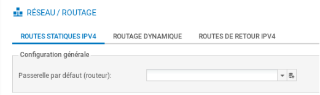

# Configuration du Pare Feu Stormshield

## 1.Reset du pare feu

 **Sur les boîtiers physiques:** un appui sur le bouton reset (attendre que les led devant clignotent) pour les boîtiers physiques permet de restaurer la configuration d'usine et redémarrer en bridge sur toutes les interfaces.

### Schema du pare feu après reset
 
 

## 2.Connexion après reset

 Pour configurer le pare-feu, il faut se brancher sur l'interface IN et mettre son poste en DHCP.

 En configuration usine sur un boîtier physique, toutes les interfaces sont incluses dans un **bridge dont l'adresse est 10.0.0.254/8**.Un serveur DHCP est actif sur toutes les interfaces du bridge et il distribue des adresses IP comprises entre 10.0.0.10 et 10.0.0.100. **L'accès à l'interface web** de configuration du pare-feu se fait avec l'url : **https://10.0.0.254/admin**.

 Par défaut, seul le compte système **admin (mot de passe par défaut admin)**, disposant de tous les privilèges sur le boîtier.

 

## 3.Configuration générale

### Modification du mot de passe de l'administrateur

 La modification du mot de passe admin se fait dans le menu **Configuration/Système/Administrateurs puis onglet Compte ADMIN**.

 

 Puis cliquer sur **Appliquer**.

### Nom

 Sélectionner dans le menu à gauche **Configuration / Système puis Configuration Générale**.

 Commencer par donner un nom à votre boîtier et changer la langue de la console.

 

 Puis cliquer sur **Appliquer**.

### Fuseau horaire

 La zone « Paramètres de date et d'heure » permet de modifier le fuseau horaire dans la zone Fuseau horaire, sélectionnez **Europe/Paris**.

 

 Après le redémarrage (au bout d'environ 3 minutes), revenir au menu Configuration / Système puis Configuration et dans la zone Paramètres de date et d'heure cliquer sur **Maintenir le pare-feu à l'heure (NTP) pour que les mises à jour d'heure d'été/heure d'hiver soient également effectives**.

 Puis cliquer sur **Appliquer**.

## 4.Configuration du réseau

 Toute les interfaces sont dans le **bridge**.

 

 Choisir une interface (par exemple IN), pour la **sortir du bridge et la configurer avec une IP fixe**.

 

 Puis cliquer sur **Appliquer**.

 Faire pareil avec les autres interfaces (WAN,DMZ).

 

## 5.Routage

### Route par défaut

 Cliquer **Configuration / Réseau / Routage / Routes statiques IPv4**.

 

 Cliquer sur l'icône  pour ajouter un objet réseau, choisir **Machine et renseigner les champs Nom et Adresse IPv4** du pare-feu puis cliquer sur le bouton Créer.

 

 Puis cliquer sur **Appliquer**.

#### Route de retour

 

## 6.Filtrage

 Allez dans **Configuration / Politique de sécurité / Filtrage et NAT**.

 Choisir la régle "**Pass all**" et modifier la colonne "**Inspection de sécurité**" en mettant "**Ne pas inspecter**".

 

 

 Puis cliquer sur **Appliquer**.