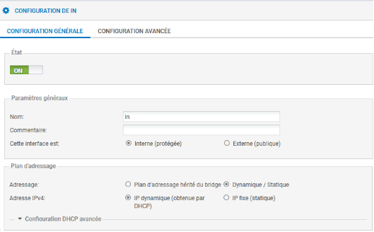

# Configuration du Pare Feu Stormshield

## 1.Reset du pare feu 

 **Sur les boîtiers physiques:** un appui sur le bouton reset (attendre que les led devant clignotent) pour les boîtiers physiques permet de restaurer la configuration d'usine et redémarrer en bridge sur toutes les interfaces.

### 1.1 Schema physique du pare feu après reset
 
 

## 2.Connexion après reset 

 Pour configurer le pare-feu, il faut se brancher sur une interface IN et mettre son poste en DHCP.

 En configuration usine sur un boîtier physique, toutes les interfaces sont incluses dans un **bridge dont l'adresse est 10.0.0.254/8**.Un serveur DHCP est actif sur toutes les interfaces du bridge et il distribue des adresses IP comprises entre 10.0.0.10 et 10.0.0.100. **L'accès à l'interface web** de configuration du pare-feu se fait avec l'url : **https://10.0.0.254/**.

 Par défaut, seul le compte système **admin (mot de passe par défaut admin)**, dispose de tous les privilèges sur le boîtier.

 

## 3.Configuration générale 

### 3.1 Modification du mot de passe de l'administrateur

 La modification du mot de passe admin se fait dans le menu **Configuration/Système/Administrateurs puis onglet Compte ADMIN**.

 

### 3.2 Nom

 Sélectionner dans le menu à gauche **Configuration / Système puis Configuration Générale**.

 Commencer par donner un nom à votre Firewall si besoin et changer la langue du clavier du CLI.

 

 Puis cliquer sur **Appliquer**.

### 3.3 Fuseau horaire

 La zone **Paramètres de date et d'heure** permet de modifier le fuseau horaire. Dans la zone Fuseau horaire, sélectionnez **Europe/Paris**.

 

Il est possible d'utiliser un serveur NTP interne ou externe afin de maintenir l'équipement à l'heure

## 4.Configuration du réseau 

 Par defaut, toutes les interfaces sont dans le **bridge**.

 

 Choisir une interface (par exemple IN) et configurer une **IP fixe** afin de la faire sortir du **Bridge**. 

 

 Faire pareil avec les autres interfaces.

 

## 5.Routage 

### 5.1 Route par défaut 

 Cliquer **Configuration / Réseau / Routage / Routes statiques IPv4**.

 

 Sur les sytèmes stormshield les configurations fonctionnent majoritairement avec les **Objets**, il vous faudras donc en crée un pour l'IP de votre passerelle. Cliquer sur l'icône  pour ajouter un objet réseau, choisir **Machine** et renseigner le nom et l'IP de votre passerelle. 

 

### 5.2 Route de retour

 

## 6.Filtrage temporaire. 

 Allez dans **Configuration / Politique de sécurité / Filtrage et NAT**.

 Choisir la régle "**Pass all**" et modifier la colonne "**Inspection de sécurité**" en mettant "**Ne pas inspecter**".

 

 

 ⚠️⚠️⚠️ **ATTENTION** ⚠️⚠️⚠️

 Cette configuration des règles est temporaire et **NON SECURISEE** il faut bien vieller a mettre en place des règles par la suite !!!

 ⚠️⚠️⚠️ **ATTENTION** ⚠️⚠️⚠️

## ⚠️ 7. Statefull Inspection

Le Stormshield dispose par défaut d’une inspection des paquets qui n’est pas désactivable. Cette inspection peut rejeter silencieusement des paquets, sans même les enregistrer dans les logs. Dans notre cas, elle pose problème avec le handshake TCP, à noter que cela ne concerne pas les connexion UDP car il n'y as aucune vérification de session (seamless).

Ce principe est la base du protocole TCP : il s'agit d'une liaison composée des états SYN, SYN-ACK et ACK. Le client envoie un SYN, le serveur répond avec un SYN-ACK, puis le client renvoie un ACK au serveur. Cela permet au client de savoir que le serveur a bien reçu son paquet grâce au SYN-ACK, et au serveur de confirmer que le client a reçu le paquet grâce à l’ACK. Ce mécanisme assure la vérification des différentes étapes de transition d’un paquet TCP.

Autrement dit, le Stormshield refuse les paquets TCP dont il n’a aucune trace d’initialisation en mémoire ou qu’il n’a pas initialisés lui-même. Par conséquent, si le Stormshield reçoit un SYN-ACK sans avoir reçu de SYN sur la même session, il ne considère pas la session TCP comme démarrée et ne répond pas à celle-ci.

Sur ce premier schéma, le flux est refusé par le Stormshield :

Sur ce schéma, nous pouvons voir qu’au lieu de renvoyer un **SYN-ACK**, le Stormshield ne renvoie rien, mettant ainsi fin à la connexion TCP sans aucune explication.

Voici donc le moyen d’assurer une communication correcte entre les équipements, sans rompre le **handshake** :

Si l’on ne passe pas par le **Stormshield**, le paquet est correctement transmis grâce au bon déroulement du **handshake**.

Et pour ne pas passer par le **Stormshield** voici la [solution](https://sym-0ne.github.io/sport-ludique-Chartres/DNS/DNS-autorité/#9-Route-statique).

---