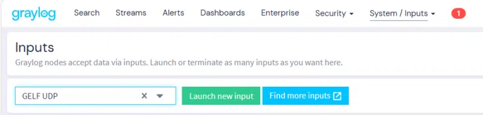
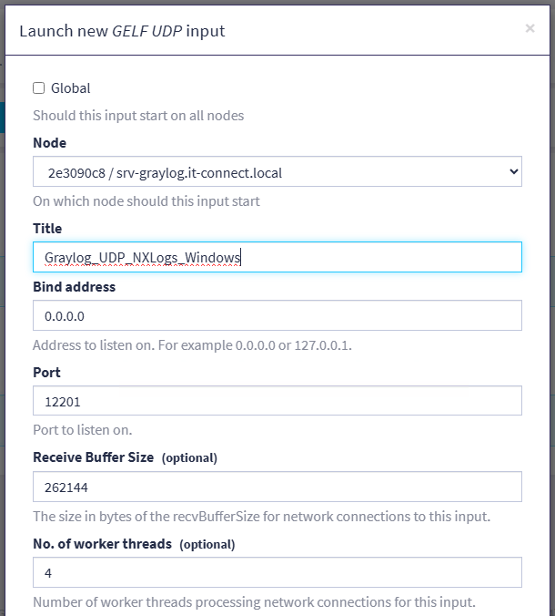
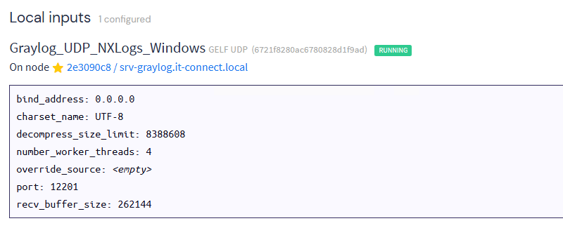

# 1 Prévol Login

Lorsque vous vous connectez à Graylog pour la première fois, vous devez utiliser les informations d'identification initiales pour l'interface Web Graylog, qui peuvent être trouvées dans le fichier journal après avoir démarré le service Graylog. 

Pour afficher votre mot de passe initial et les instructions incluses dans le fichier journal, entrez la commande suivante :

```
tail /var/log/graylog-server/server.log
```

# 2 Accéder à l'interface Web

Après avoir terminé votre connexion prévol, vous pouvez accéder à l'interface Web avec vos identifiants habituels :

- Ouvrez un navigateur compatible et accédez à l'URL https://xxx.xxx.xxx.xxx:9000. Remplacez l'adresse IP de votre serveur Graylog.

- Connectez-vous en tant qu'administrateur et utilisez le secret de mot de passe que vous avez créé lorsque vous avez installé Graylog.


# 3 Créer un input dans Graylog

La première étape consiste à créer un nouvel **"Input"** dans la configuration de Graylog, car les données sont reçues de cette façon. À partir de l'interface web de Graylog, cliquez sur le menu **"Système"** puis sur **"Inputs"**. Ensuite, sélectionnez **"GELF UDP"** dans la liste, puis cliquez sur **"Launch new input"**.



Une fenêtre apparaît à l'écran... Vous devez configurer ce nouvel **Input**. Vous pouvez utiliser un Input par typologie de machines : un Input peut être utilisé par plusieurs machines Windows. Nommez cet Input, par exemple **"UDP_Windows"**, et indiquez "0.0.0.0" comme **"Bind address"** pour qu'il soit accessible sur toutes les interfaces de l'hôte Graylog. Nous pouvons constater que la connexion sera effectuée sur le port 12201.



Validez. Vous aurez alors une sortie similaire à celle ci-dessous.



La configuration de Graylog est terminée, maintenant pour la suite il faut allez voir pour configurer les logs sur [Debian](https://sym-0ne.github.io/sport-ludique-Chartres/Serveurs/Logs/Rsyslog/), [Windows](https://sym-0ne.github.io/sport-ludique-Chartres/Serveurs/Logs/NXlog/) et les [Pare-feu](https://sym-0ne.github.io/sport-ludique-Chartres/Serveurs/Logs/LogPFWetVFW/).