# Installer et configurer Active Directory sur Windows Server.

## Introduction

L’Active Directory (AD) est une fonctionnalité essentielle dans les environnements Windows Server, permettant la gestion centralisée des utilisateurs, des ordinateurs et des ressources réseau. Dans cet article, nous allons vous guider pas à pas pour installer le rôle Active Directory et promouvoir votre serveur en tant que contrôleur de domaine.
Pré-requis

Avant de commencer, assurez-vous de remplir les prérequis suivants :

    Système d’exploitation : Un serveur Windows (Windows Server 2016/2019 minimum recommandé ou 2022 ou 2025).
    Configuration réseau :
        - Une adresse IP fixe configurée.
        - Un nom d’hôte clairement défini.
    Accès administrateur : Les droits d’administrateur local sur le serveur.
    Mise à jour : Le serveur est à jour avec les derniers correctifs de sécurité.

---

## 1. Préparer votre serveur 

### 1.1 Configurer une adresse IP fixe :
Se rendre dans « Panneau de configuration -> Réseau et internet -> Centre réseau et partage -> Cliquer sur votre carte réseau -> Propriété :

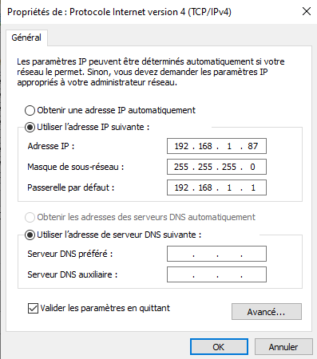

Définissez une adresse IP, un masque de sous-réseau et une passerelle.

### 1.2 Renommer le serveur :
Allez dans Paramètres > Système > Informations système > Renommer ce PC.

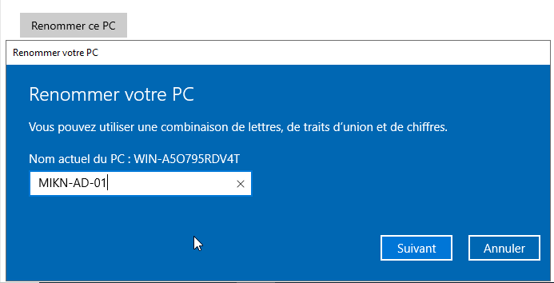

Donnez-lui un nom descriptif, comici c'est ```CHA_DC_01``` pour le premier contrôleur de domaine.

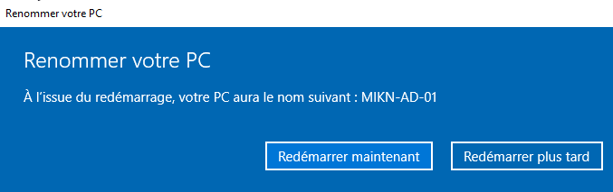

Puis **Redémarrez le serveur.**

---

## 2. Ajouter le rôle Active Directory 

### 2.1 Ouvrir le Gestionnaire de Serveur :
Cliquez sur Gérer > Ajouter des rôles et fonctionnalités.

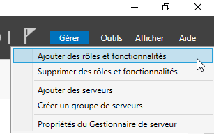

### 2.2 Sélectionner le type d’installation :
Choisissez Installation basée sur un rôle ou une fonctionnalité et cliquez sur Suivant.

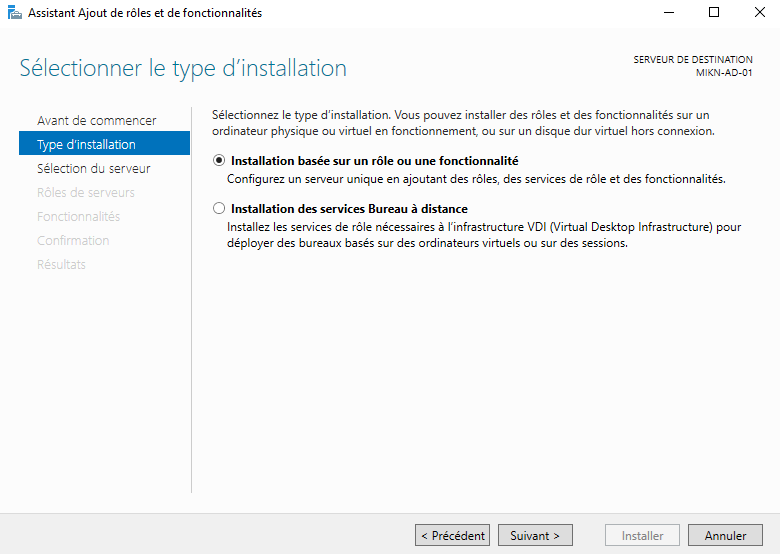

### 2.3 Choisir le serveur cible :
Sélectionnez le serveur sur lequel installer le rôle.

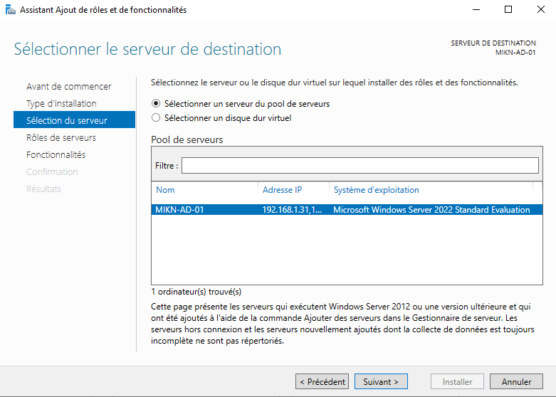

### 2.4 Sélectionner le rôle Active Directory :
Dans la liste, cochez Services de domaine Active Directory (AD DS).

Confirmez l’ajout des fonctionnalités nécessaires.

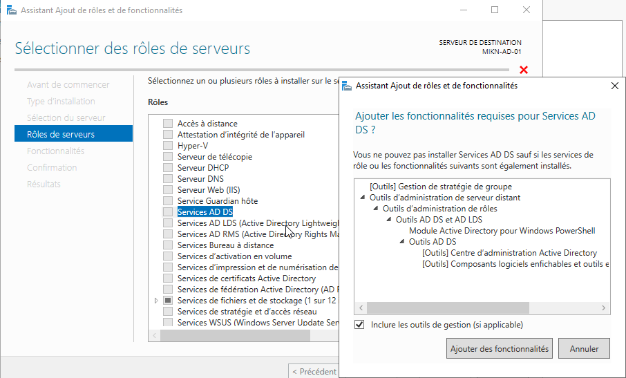

### 2.5 Finaliser l’installation :
Cliquez sur Installer.

Une fois terminé, ne redémarrez pas immédiatement, car vous devrez promouvoir le serveur en tant que contrôleur de domaine.

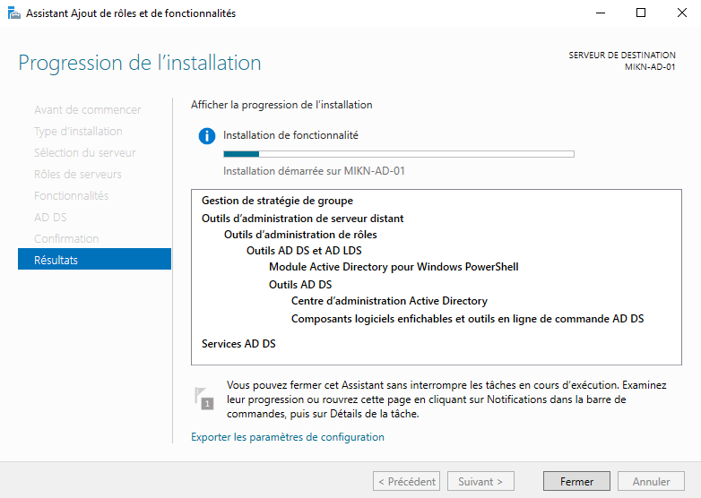

---

## 3. Promouvoir le Serveur en Contrôleur de Domaine 

### 3.1 Lancer l’assistant :
Dans le Gestionnaire de Serveur, cliquez sur la notification indiquant que la configuration post-installation est nécessaire.

Cliquez sur Promouvoir ce serveur en contrôleur de domaine.

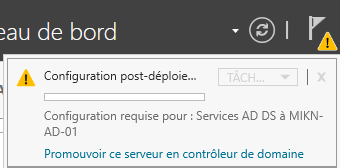

### 3.2 Créer un nouveau domaine :

Choisissez Ajouter une nouvelle forêt.
Entrez le nom de domaine racine, ici c'est ```cha.chartres.sportludique.fr```
pour les pages 
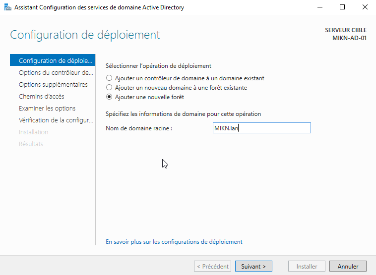

### 3.3 Configurer les options du domaine :
Sélectionnez le niveau fonctionnel de la forêt et du domaine (Windows Server 2016 ou plus récent).

Configurez un mot de passe pour le mode de restauration des services d’annuaire (DSRM).

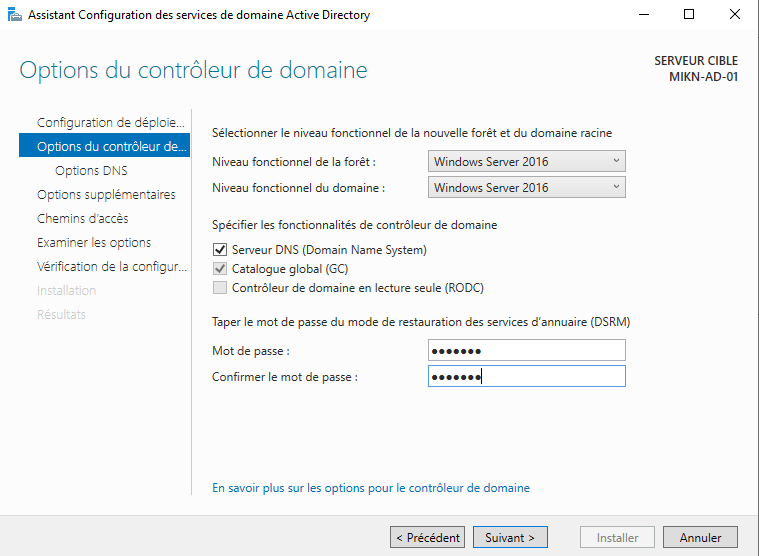

### 3.4 Vérification DNS et NetBIOS :
Vérifiez le nom NetBIOS proposé et ajustez-le si nécessaire.

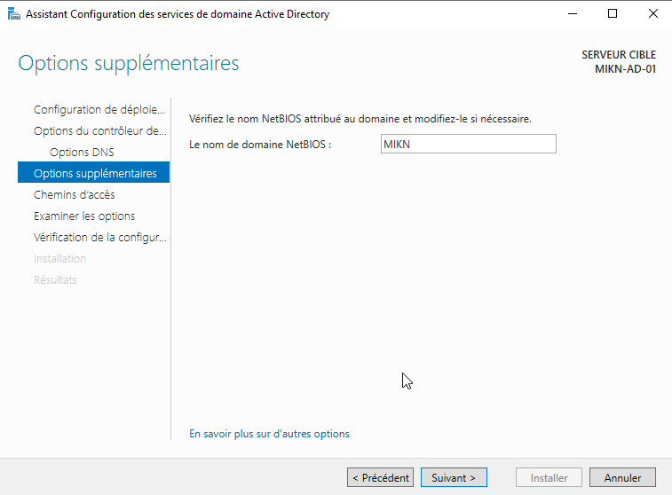

### 3.5 Valider et installer :
Laissez l’assistant valider la configuration.

Cliquez sur Installer. Le serveur redémarrera automatiquement.

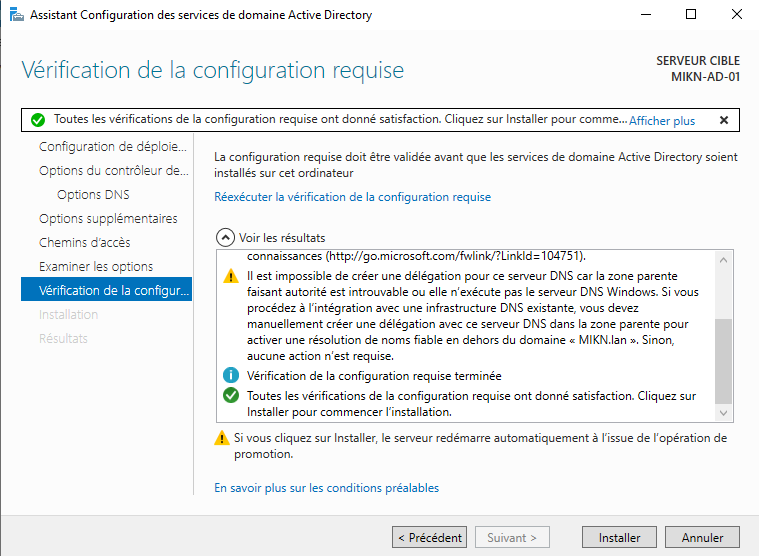

---

## 4. Vérifier l’installation 

### 4.1 Confirmer le rôle Active Directory :
Après le redémarrage, connectez-vous et ouvrez le Gestionnaire de Serveur.
Vérifiez que le rôle AD DS est installé et fonctionne correctement.

### 4.2 Tester le domaine :
Ouvrez l’outil Active Directory Users and Computers.

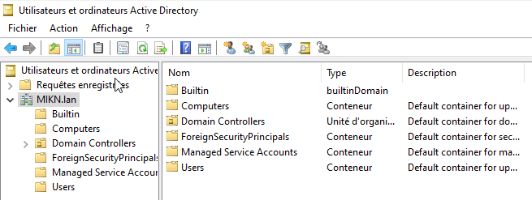

Assurez-vous que votre domaine apparaît et que les objets par défaut (comme ```Users``` et ```Computers```) sont présents.

---

## 5. Conclusion 

Vous avez maintenant un serveur configuré comme contrôleur de domaine. Les prochaines étapes incluront :

1. **Créer des unités organisationnelles (OU) :** Pour organiser les utilisateurs et les ordinateurs.
2. **Ajouter des utilisateurs au domaine :** Créez des comptes pour les utilisateurs.
3. **Joindre un ordinateur au domaine :** Pour intégrer des machines au réseau Active Directory.

---