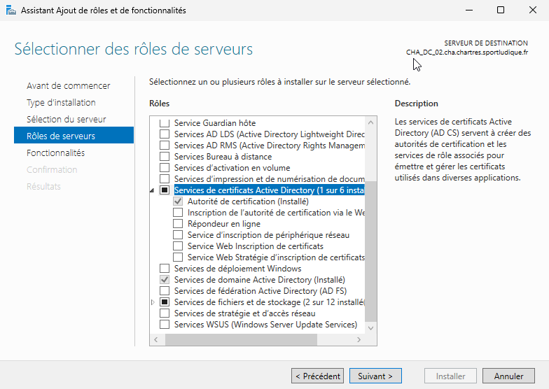
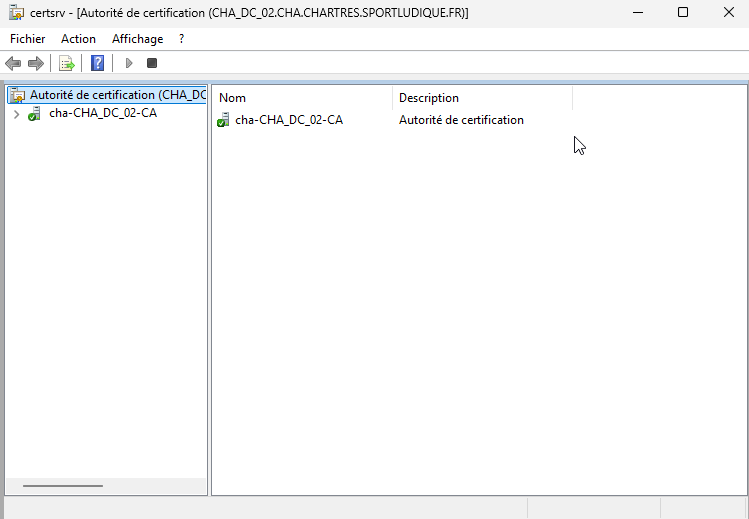
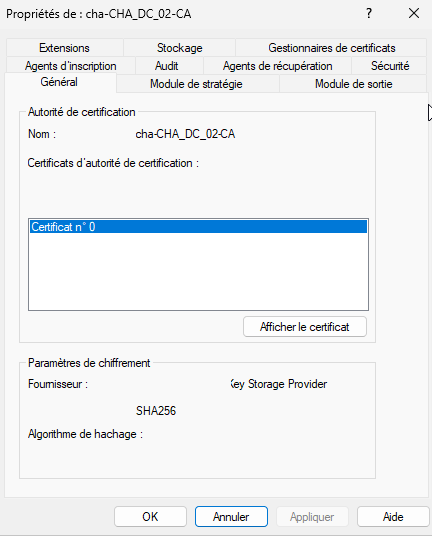
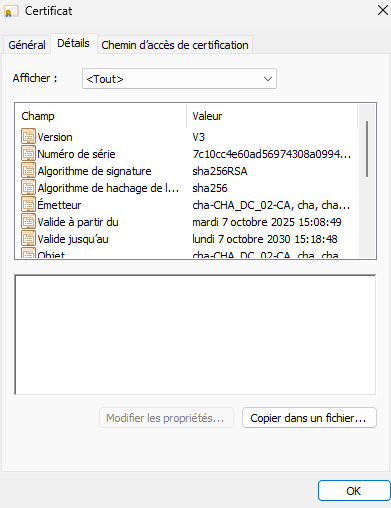

# Mise en place AD CS (Active Directory Certificate Services)

----------------------------------------------------------

## 1. À quoi ça sert ?

 AD CS est un rôle de Windows Server qui permet de **créer et de gérer une infrastructure de gestion de certificats (PKI — Public Key Infrastructure)**. 
 Concrètement, il sert à émettre, renouveler et révoquer des certificats numériques utilisés pour sécuriser les communications et authentifier les utilisateurs, ordinateurs ou services dans un environnement Active Directory.

---------------------------------------------------------

## 2. À quoi ça sert dans un Active Directory 

- **Authentification sécurisée** : permet d’utiliser des certificats pour authentifier les utilisateurs et les machines (par exemple, avec les connexions Wi-Fi 802.1X ou VPN).
- **Chiffrement** : les certificats permettent de chiffrer les échanges (HTTPS, e-mails, fichiers…).
- **Signature numérique** : garantit l’intégrité et la provenance des documents ou du code.
- **Automatisation** : dans un domaine AD, la délivrance et le renouvellement des certificats peuvent être automatisés via les stratégies de groupe (GPO).

### Installer le rôle « AD CS »

Allez dans "**Ajouter des rôles et des fonctionnalités**".

Puis installer le service ci-dessous :

Finir l'intallation.

### Télécharger les certificats sur la machine physique

Allez dans le service et ouvrir **L'autorité de certification** :

Puis cliquez sur **cha-CHA_DC_02-CA** et allez dans les **Propriétés** :

Ensuite faite **Afficher le certificat** et allez dans **Détails** :

Enfin cliquer sur **Copier dans un fichier** et suivre l'assistant d'exportation pour télécharger le fichier sur votre machine physique.

### Certificat sur Proxmox

Afin de mettre en place le certificat sur Proxmox, allez voir la documentation suivante : [LDAPS sur Proxmox](https://sym-0ne.github.io/sport-ludique-Chartres/Hyperviseur/ldaps-prox/)
