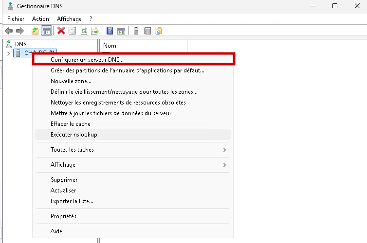

# Installer et configurer un serveur DNS sur Windows Server.

Dans l’assistant, sélectionnez **Installation basée sur un rôle ou une fonctionnalité** :  

Choisissez votre serveur dans la liste proposée :  

Dans la section des rôles, sélectionnez le rôle **DNS** :  

Passez ensuite à la section **Confirmation** et cliquez sur **Installer** pour lancer l’installation.

----------------------------------------------------------

## 1. Configuration du service DNS 

Dans l’onglet **Outils**, sélectionnez le service **DNS** :  

Effectuez un clic droit sur votre serveur puis cliquez sur **Configurer un serveur DNS** :  

Créez une **zone de recherche directe** :  

Notre serveur gère la zone entière et délègue les requêtes inconnues au DNS de notre FAI :  

Ajoutez le nom de la zone de recherche, dans notre cas **chartres** :  

Par mesure de sécurité, seules les **mises à jour dynamiques sécurisées** seront autorisées :  

Ajoutez l’adresse IP du DNS public de votre choix. Dans notre cas, nous utilisons le serveur du réseau Internet fictif :  

Enfin, enregistrez votre nouvelle **zone de recherche DNS** :  

