# Installation et configuration d’un serveur de fichiers sur Windows Server

## 1. Introduction

Un serveur de fichiers permet de centraliser, partager et sécuriser l’accès aux données dans une infrastructure réseau. C’est l’un des rôles les plus courants et utiles sur un serveur Windows. 

Dans cet article, nous allons voir comment installer et configurer un serveur de fichiers sur Windows Server, avec une explication des différentes options disponibles pour adapter la configuration à vos besoins.

---

## 2. Prérequis

Un Windows Server installé (et de préférence rejoint à un domaine). Un disque ou volume disponible pour le stockage des données. Une connexion à l’interface d’administration(Gestionnaire de serveur).

A) Installer le rôle « Serveur de fichiers »
B) Ouvrir le Gestionnaire de serveur.
C) Cliquer sur Gérer, puis sur Ajouter des rôles et fonctionnalités :

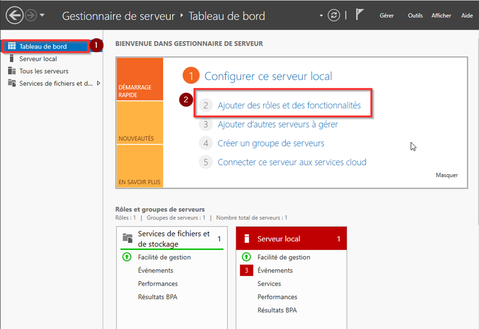

Dans l’assistant, sélectionner Installation basée sur un rôle ou une fonctionnalité :

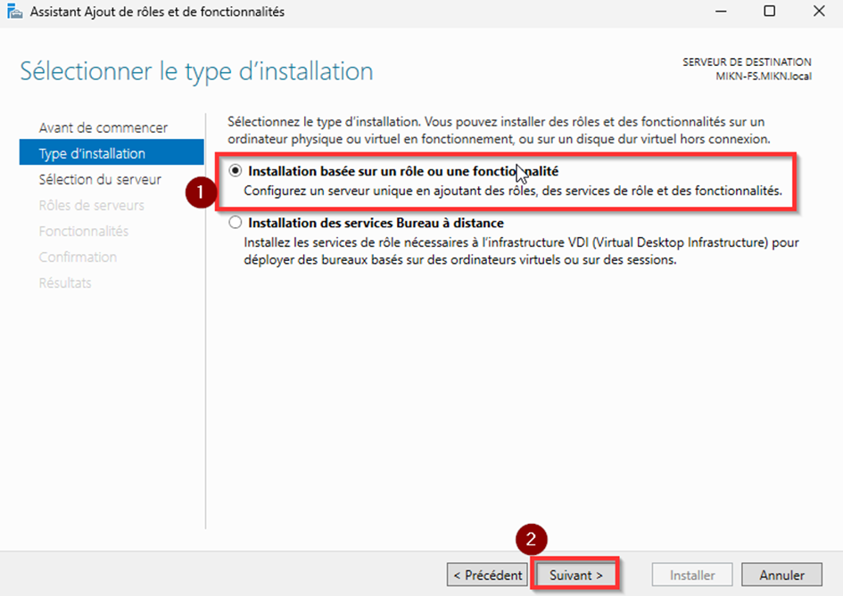

Choisir votre serveur dans la liste proposée :

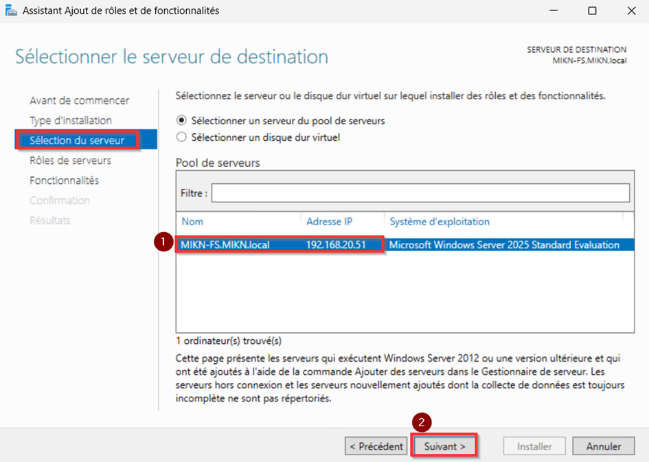

Dans la section des rôles, cocher Services de fichiers et de stockage, puis Services de fichiers et iSCSI puis cochez Serveur de fichiers dans les sous-rôles proposés :

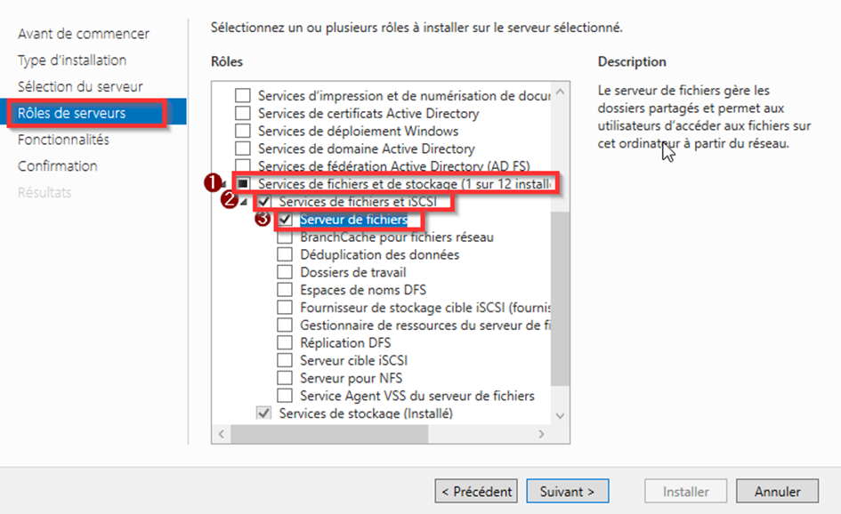

Pour une configuration standard, le Serveur de fichiers suffit.
Passez à la section Confirmation et cliquez sur Installer pour lancer l’installation.
Vous pouvez ensuite cliquer sur Installer :

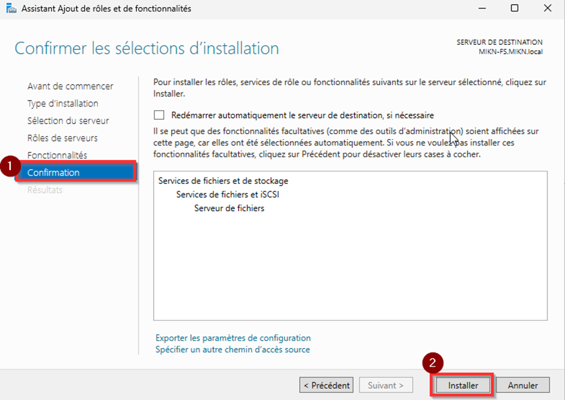

Finaliser l’installation en suivant l’assistant jusqu’au bout :

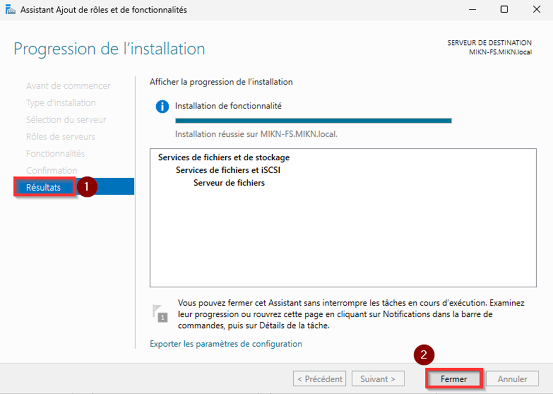

2. Créer un dossier partagé

Ouvrir l’outil Gestionnaire de serveur, puis aller dans Services de fichiers et de stockage > Partages :

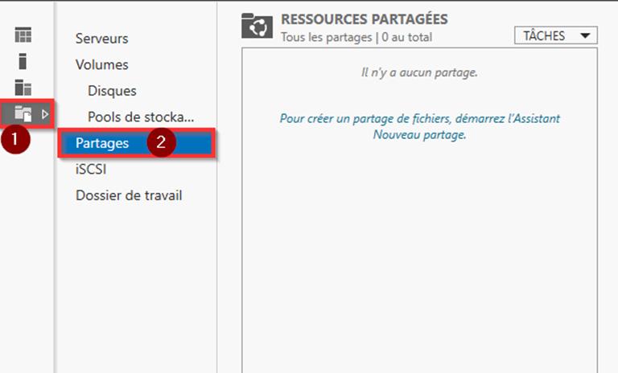

Cliquer sur Tâches, puis sélectionner Nouveau partage :

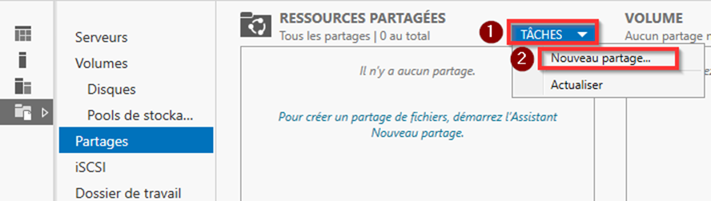

Choisir le type de partage selon le besoin : SMB – Partage rapide pour un usage courant, ou SMB – Avancé pour configurer plus en détail les autorisations :

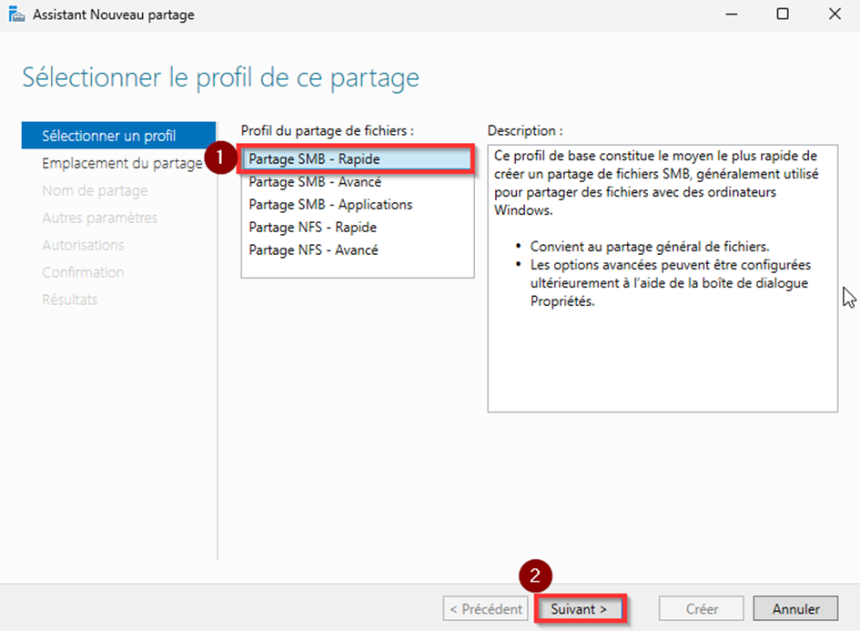

Sélectionner le serveur et le disque sur lequel sera créé le dossier à partager, ou en créer un nouveau via l’interface :

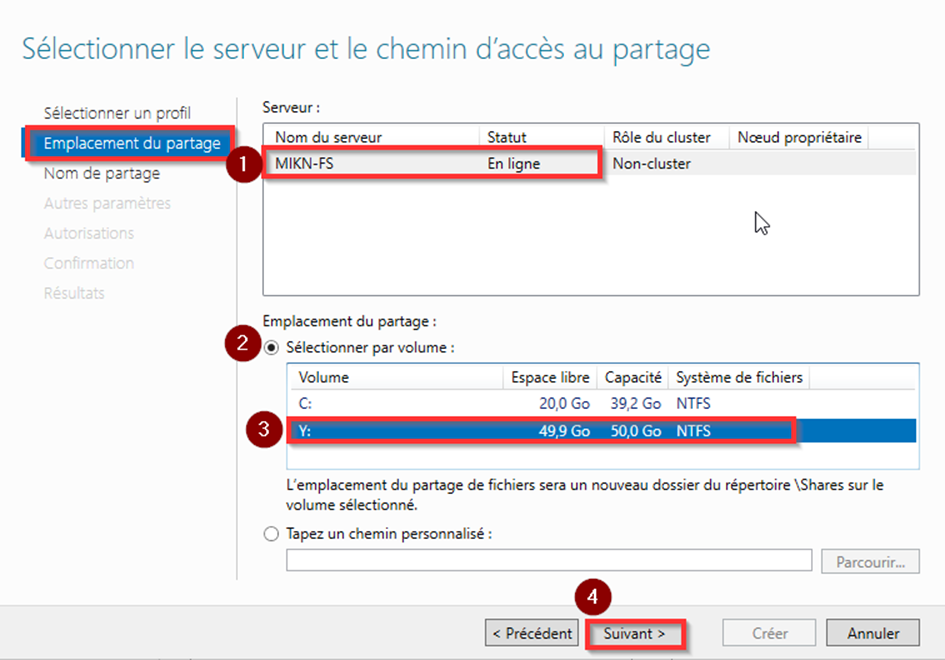

Définir les paramètres comme le nom du partage, le chemin d’accès :

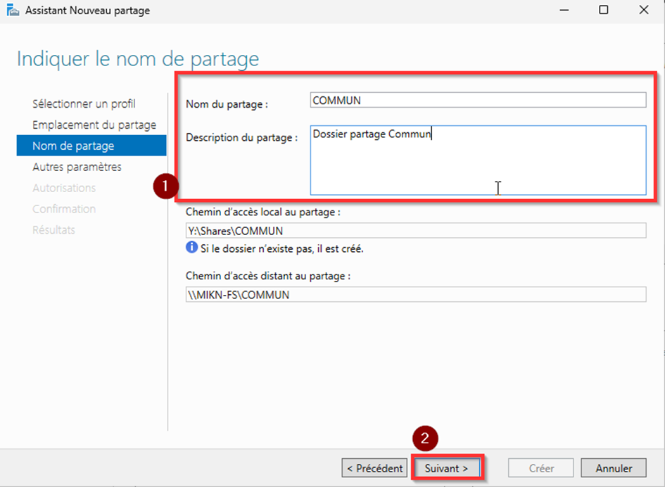

Configurer les autorisations d’accès selon les besoins (voir section suivante pour les détails) :

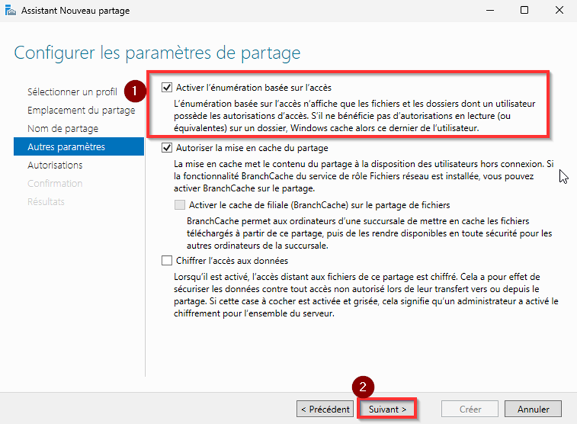

---