# Installer et configurer un serveur DHCP sur Windows Server 2025.

## Etape 1. Installation du rôle DHCP
Ouvrir le Gestionnaire de serveur.
Cliquer sur Gérer, puis sur Ajouter des rôles et fonctionnalités.

Choisir : « Installation basée sur un rôle ou une fonctionnalité ».

Sélectionner le serveur local.

Cocher **Serveur DHCP**, ajouter les fonctionnalités proposées.

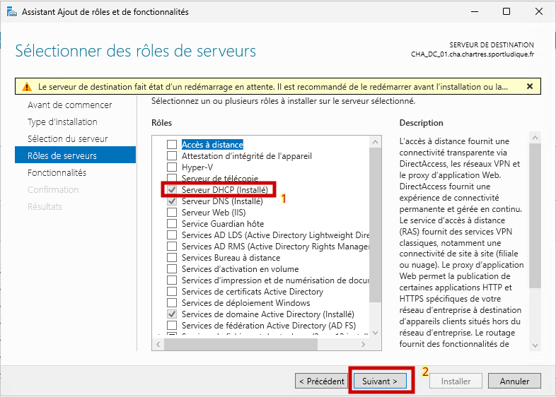

**Nous n’allons pas ajouté de fonctionnalité**, nous pouvons faire suivant : 

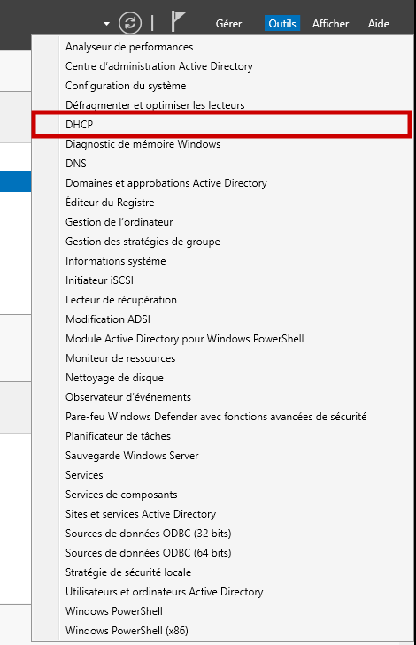

Dérouler la petite flèche pour accéder aux options :

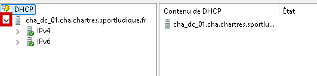

Faire une nouvelle étendue : 

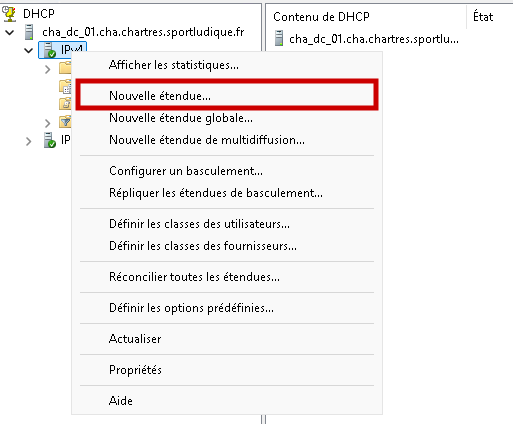

Cliquer sur suivant pour passer à la prochaine étape : 

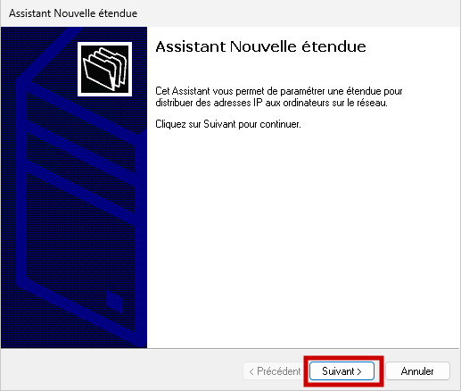

Nommer l'étendue et une description pour préciser sa signification **(La description est facultative)**

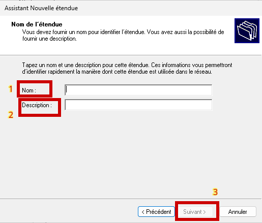

Remplir l'entendue avec les adresses IP correspondantes aux besoins.

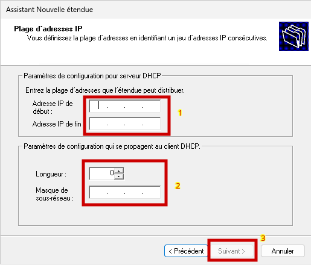

Remplir les adresses IP exclu des étendues DHCP.

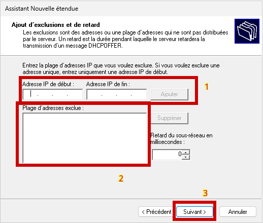

Ne pas toucher au bail, cliquer juste sur Suivant.

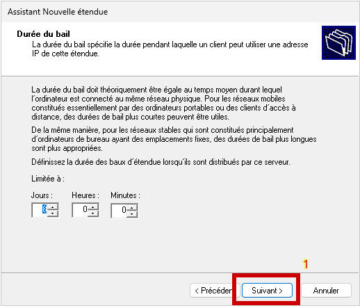

Confirmer la mise en place de l'etendue DHCP.

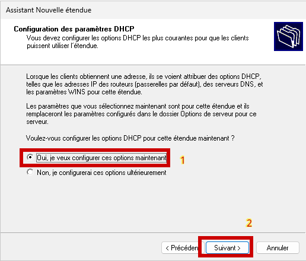

Ajouter une passerelle par défaut pour le routeur qui permettra l'accès à Internet.

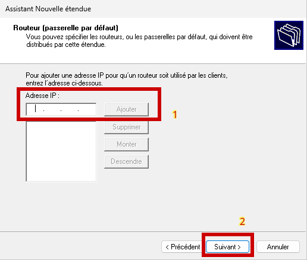

Ajouter un nom de Domaine ainsi que l'adresse correspondante au serveur DNS.

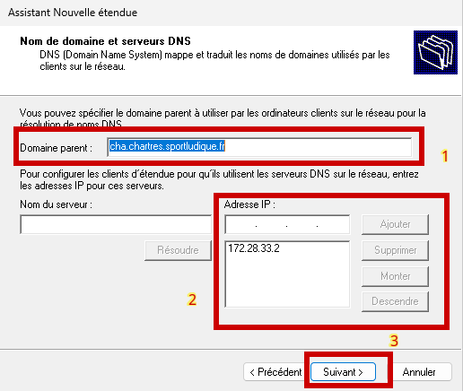

On ne mettra pas de serveur WINS, cliquer sur Suivant.

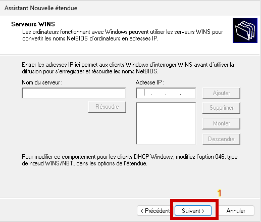

Confirmer l'activation de l'etendue.

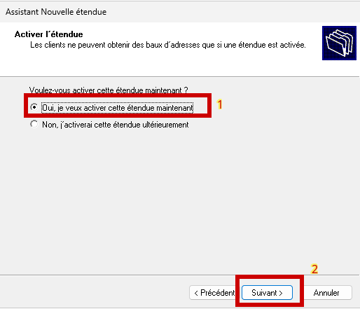

Cliquer sur Suivant.

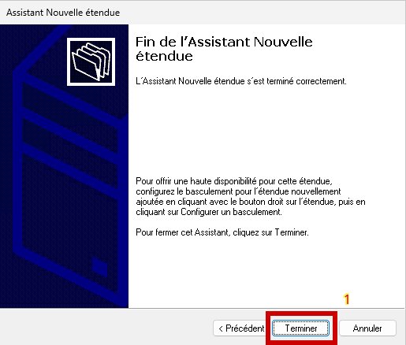

Dérouler les flèches afin de vérifier si les extensions apparaissent bien dans le menu DHCP.

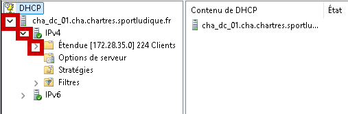

