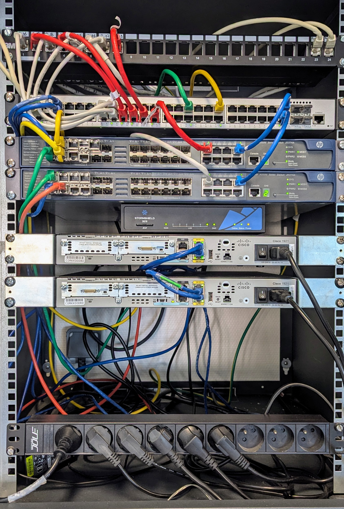

# Accueil - Pôle Chartres 

## Présentation

**BTS SIO option SISR**  
Année scolaire 2025-2026  

**Enseignant :** Ludovic MERY  
**Co-Enseignant :** Kevin Huet  

---

## <ins>Le Pôle Chartres</ins>

Le site de **Chartres** est le siège de **SportLudique SARL** et regroupe les fonctions stratégiques et administratives de l’entreprise. Il constitue le cœur opérationnel de la société avec plusieurs départements clés.

### <ins>Fonctions et départements</ins>

Le site de Chartres accueille :

- **Direction générale**  
- **Marketing**  
- **Finances**  
- **Ressources humaines**  
- **Direction des Services Informatiques (DSI)**

> La DSI est dirigée par **Monsieur Claude Postic** et compte 4 techniciens.  
> Le service RH est dirigé par **Madame Helen Paisley-Le Bihan**.

### <ins>Mission du site</ins>

Le Pôle Chartres assure la coordination des activités de l’ensemble des sites et joue un rôle central dans :

- La gestion administrative et financière  
- Le marketing et la promotion des produits  
- La supervision de la production et de la logistique via les autres sites  
- Le support et la maintenance informatique interne  

### <ins>Informations clés</ins>

- **Siège social :** Agglomération chartraine  
- **Effectif sur le site :** Inclus dans les 452 employés de l’entreprise  
- **Activité :** Conception et fabrication d’articles de sports et loisirs, ainsi que la proposition d’installations clé en main aux collectivités  

### <ins>Schema réseau</ins>

### <ins>Schema physique</ins>

### <ins>Photo de la baie</ins>

### <ins>Photo de la baie serveur</ins>

